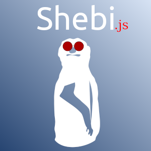

## shebi-js - Javascript event for CSS position:sticky



## Motivation

Inspired by [this Google Article](https://developers.google.com/web/updates/2017/09/sticky-headers), `Ezekiel 3:17` shebi, _watchman_, adds a DOM event to a HTML Element to observer when the Element starts behaving sticky.

## Installation

```
npm i shebi
```

## Usage

```javascript
import shebi from "shebi";
import "shebi/css/shebi.css";

shebi("selector").on("stick-change", evt => {
    let target = evt.details.target;
    let stuck = evt.details.stuck;

    if (stuck) {
        // do something
        target.classList.add('shadow');
    } else {
        target.classList.remove('shadow');
    }
});
```

The package adds a class `sticky_sentinel--wrapper` to the parent of the `target selector`.

## Config

You can set the debug mode to see when the inserted DIV **shebi** uses to determine when the `target selector` is stuck or not.

```javascript
let shebyjs = shebi('selector', { debug: true });
```


